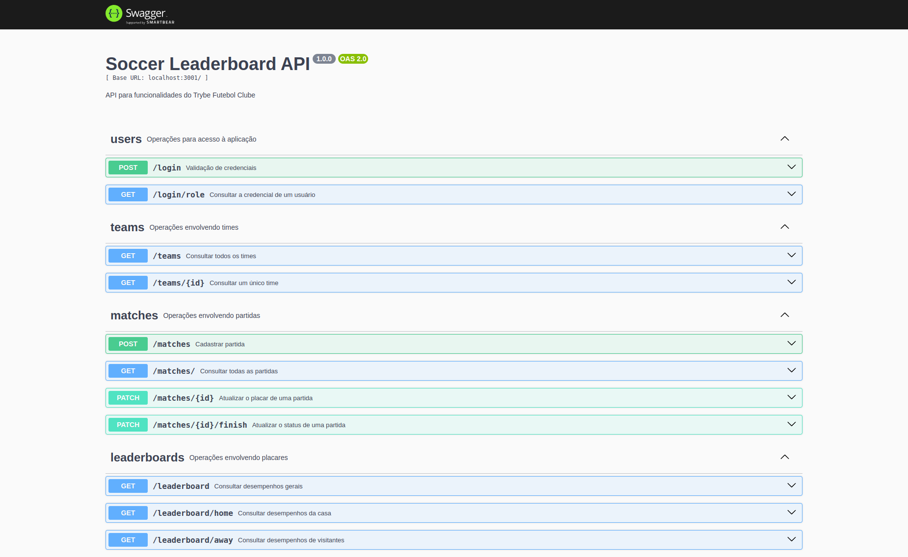
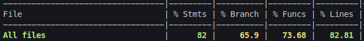
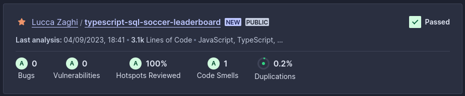

# Delivery App - Birita Go

Essa é uma implementação de uma aplicação fullstack, com uso de React, Node.js (Typescript) com Express.js, e banco de dados MySQL. </br>É um aplicativo de um gerenciador de partidas e classificações de futebol, no qual é possível acessar e manipular dados de times, partidas e placares.

A aplicação foi construída com a arquitetura MSC (model-service-controller) e foi Dockerizada.</br>
Tudo isso com validações e testes pensados para os casos de uso da aplicação, garantindo a qualidade e integridade do código.

O foco dessa projeto foi praticar a construção de um back-end dockerizado usando modelagem de dados através do Sequelize, e integrar a API a um front-end já construído.


## Funcionalidades
- Login na plataforma
- Validação de token para operações na aplicação
- Consulta de todos os times listados ou de um time específico
- Consulta de todas as partidas
- Consulta filtrada de partidas (finalizadas ou em andamento)
- Cadastro de uma nova partida
- Atualizar o placar de uma partida em andamento
- Alterar o estado de uma partida para 'finalizada'
- Consulta de placares das partidas
- Consulta de informações de desempenho dos times (pontos, jogos, vitórias, empates, derrotas, gols marcados, gols sofridos, saldo de gols, aproveitamento)


## Instalação e execução local

Para rodar esta aplicação é necessário ter o Docker e o Docker Compose (v1.29 ou superior) instalados em sua máquina.

1. Clone o repositório e entre no diretório
```bash
  git clone git@github.com:lzaghi/typescript-sql-soccer-leaderboard.git
  cd typescript-sql-soccer-leaderboard
```

2. Instale as dependências 
```bash
  npm install
```

3. Suba os containeres do front, back e banco de dados
```bash
  npm run compose:up
```

A aplicação já estará rodando! :)</br>
Acesse ```http://localhost:3000``` para a experiência de usuário. O back-end estará rodando em ```http://localhost:3001```.


4. Para rodar os testes entre no container do back-end e execute o comando
```bash
  docker exec -it app_backend sh
  npm run test:coverage
```


## Documentação

A documentação completa da API, com todas as operações possíveis, pode ser consultada na rota ```http://localhost:3000/swagger```, após a aplicação estar rodando.



Credenciais de acesso presentes por padrão no banco de dados:

- Usuário
```bash
  email: user@user.com
  senha: secret_user
```

- Administrador
```bash
  email: admin@admin.com
  senha: secret_admin
```

## Demonstração

~ em breve! ~

## Cobertura de testes

### Back-end



## Tecnologias utilizadas

React.js, Node.js com Typescript, Express.js, MySQL, Docker, JWT, Mocha, Chai, Sinon, Arquitetura MSC, API RESTful, Swagger


## Qualidade de Código

Análise SonarCloud




